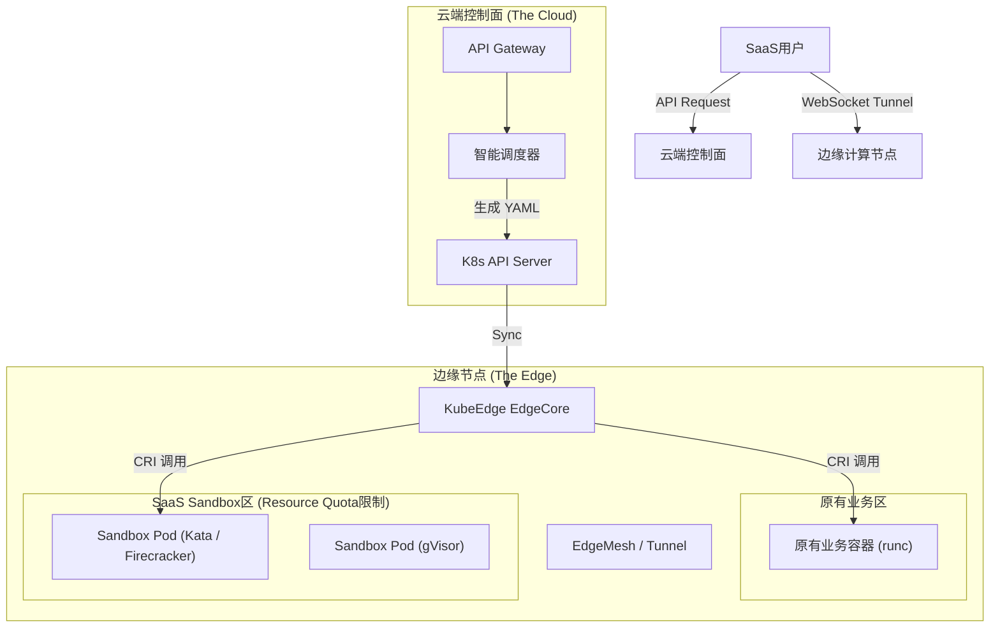

# 边缘 AI Sandbox SaaS 平台架构设计方案

**文档状态：** 初稿 / 架构定调  
**核心场景：** KubeEdge 边缘架构 + 第三方设备资源复用 + SaaS 商业售卖

---

## 1. 业务背景与核心需求

### 1.1 资源现状
*   **基础设施：** 资源来源于租用的第三方边缘设备。
*   **管理架构：** 设备已通过 KubeEdge 方案接入集群进行统一管理。
*   **环境约束：** 设备上已运行其他原有业务（Legacy Workloads），**必须保证原有业务的绝对稳定性**。

### 1.2 业务目标
*   **SaaS 售卖：** 构建一个类似 **e2b** 的 Sandbox SaaS 平台，面向 AI Agent 开发者售卖代码执行环境。
*   **复用变现：** 利用边缘设备的闲置资源（CPU/内存）运行 Sandbox，降低成本。

---

## 2. 技术选型评估与决策

### 2.1 方案对比
在架构选型阶段，我们评估了两种主流路径：

| 方案 | 核心技术 | 优势 | 劣势 | 结论 |
| :--- | :--- | :--- | :--- | :--- |
| **K8s 原生** | agent-sandbox (K8s RuntimeClass) | **稳健性高**：Kubelet 全局管控，避免资源超卖导致原有业务崩溃。**运行时独立**：已支持runc,kata,gVisor,可扩展。 | **启动慢**：标准 Pod 启动需秒级，商业体验较差。 | **入选 (作为骨架)** |
| **E2B 架构** | 直接编排 Firecracker MicroVM | **速度极快**：毫秒级启动，极致性能。 | **风险**：与原业务资源竞争隐患；单一运行时 | **部分入选 (作为皮肤)** |

### 2.2 融合型方案

*   **产品层（对外）：** 复制 **e2b**。SDK、API 接口、WebSocket 通信协议完全兼容 e2b，提供顶级的开发者体验。
*   **调度层（对内）：** 遵守 **KubeEdge/K8s 标准**。拒绝绕过 Kubelet，确保 K8s 调度器对每一分资源消耗都有全局掌控力。
*   **隔离层（核心）：** 采用 **RuntimeClass 动态路由**。分期实现不同隔离方案，隔离策略等。

---

## 3. 系统架构设计 (Architecture)

### 3.1 总体架构蓝图

### 3.2 关键组件设计

#### A. 边缘节点层 (Infrastructure)
需要在 KubeEdge 节点上集成多运行时环境：
1.  **标准运行时 (runc):** 用于原有业务，保持零损耗。
2.  **安全运行时 (Sandbox Runtime):**
    *   **首选 (Kata Containers):** 配置 QEMU 或 Firecracker 作为 VMM。适用于支持嵌套虚拟化 (VT-x/AMD-V) 的设备。
    *   **备选 (gVisor):** 适用于不支持虚拟化的老旧设备。
3.  **网络隧道 (Tunnel Sidecar):** 每个 Sandbox 需运行一个轻量级 Agent，通过 WebSocket 主动反向连接云端，穿透边缘 NAT。

#### B. 云端控制层 (Control Plane)
摒弃 e2b 原生的编排器，开发适配 KubeEdge 的控制器：
1.  **API Gateway:** 接收 `sandbox.create()` 请求。
2.  **Smart Scheduler:**
    *   查询 K8s 节点标签 (`virtualization=true/false`)。
    *   生成标准 Pod YAML，注入 `runtimeClassName: kata` 或 `runtimeClassName: gvisor`。
    *   下发至 K8s API Server。

---

## 4. 潜在架构风险梳理与应对 (New)

### 4.1 云端隧道网关带宽瓶颈 (Tunnel Bandwidth)
**问题描述：** 由于边缘设备处于内网，所有用户与 Sandbox 的流量都必须经过云端网关中转。若用户在 Sandbox 内进行大文件上传下载（如数据集处理），会瞬间打满云端网关带宽，导致成本激增且服务阻塞。

**应对策略：**
1.  **流量分流 (Traffic Splitting):** 
    *   **控制流 (KB级):** 走 WebSocket 隧道，用于传输指令、日志、终端交互。
    *   **数据流 (GB级):** **禁止走隧道**。开发 Presigned URL 机制，用户直接与 S3/对象存储交互，Sandbox 内部再从 S3 拉取。
    *   **出站流 (GB级):** Sandbox 访问公网直接走边缘设备本地带宽，不回源云端。
2.  **QoS 限速:** 在隧道网关层对每个连接实施带宽限速（如 2MB/s），并在商业套餐中区分定价。

### 4.2 KubeEdge 控制面风暴 (Control Plane Storm)
**问题描述：** 若业务爆发，数千台边缘设备同时上报状态或拉取 Pod 配置，可能导致 CloudCore 或 etcd 瘫痪。

**应对策略：**
1.  **分片管理 (Sharding):** 不要试图用一个 K8s 集群管理万级边缘节点。按地域或业务组划分多个 KubeEdge 集群。
2.  **心跳降频:** 针对 Sandbox 这种易变负载，适当降低 EdgeCore 的心跳上报频率，减少无效更新。

### 4.3 镜像分发延迟 (Image Pull Latency)
**问题描述：** 边缘网络环境恶劣，用户创建 Sandbox 时若遇上冷启动且需拉取 500MB 镜像，会导致超时失败。

**应对策略：**
1.  **预拉取 (Pre-pull):** 利用 KubeEdge 的 ImagePrePull 功能或闲时 DaemonSet，强制所有节点在凌晨缓存基础镜像。
2.  **极简镜像:** 基础镜像只包含最核心的 kernel/python，依赖库尽量通过挂载 Volume 或动态安装解决。

---

## 5. 核心风控与优化策略

### 5.1 安全风控：原有业务保护机制
为了确保“寄人篱下”不影响宿主，实施以下双重锁：

1.  **资源大锁 (Resource Quota):**
    *   为 Sandbox Namespace 设置资源上限（例如：只允许使用总资源的 30%）。
    *   *目的：* 无论 SaaS 用户如何滥用，绝对保留缓冲资源给宿主系统和原有业务。
2.  **优先级压制 (PriorityClass):**
    *   **原有业务:** `Priority: System-Critical (10000)`
    *   **Sandbox:** `Priority: Best-Effort (10)`
    *   *效果：* 资源竞争时，Kubelet 会优先杀掉 Sandbox Pod，确保原有业务存活。

### 5.2 性能优化：预热池 (Warm Pool)
解决启动慢的核心手段。
*   **机制：** 在边缘节点常驻 N 个“空闲”状态的 Sandbox Pod。
*   **流程：** 用户请求 -> 立即分配空闲 Pod (毫秒级返回) -> 异步补充新 Pod。
*   **资源控制：** 配合 HPA，根据节点负载动态调整预热池大小（忙时缩容，闲时扩容）。

### 5.3 规模扩展：Megapod 模式
解决 K8s Pod 数量上限问题。
*   **机制：** 针对超轻量级任务（如 Wasm），不直接创建 Pod。
*   **实现：** 预先启动大规格 Pod (Slot)，在 Pod 内部通过进程/线程隔离运行多个 Sandbox 实例。

---

## 6. MVP 版本实施路线图 (Roadmap)

本路线图旨在用最短时间打通核心链路：**从用户通过 SDK 发起请求，到边缘设备上安全启动沙盒并返回结果。** 暂不包含复杂的计费与大规模风控。

### Phase 1: 运行时集成 (边缘端基础设施)
**目标：** 确保边缘节点具备“混合双打”能力，能同时运行原有业务和安全沙盒。

*   **1.1 基础设施摸底与打标**
    *   下发 DaemonSet 脚本，自动检测虚拟化支持 (`grep vmx/svm`)。
    *   自动给节点打标：`sandbox-type=hard` (Kata) 或 `sandbox-type=soft` (gVisor)。
*   **1.2 运行时组件分发**
    *   编写脚本批量安装 `containerd`, `kata-containers`, `gvisor (runsc)`。
*   **1.3 Containerd 配置魔改**
    *   修改 `/etc/containerd/config.toml`，注册 `kata` 和 `runsc` 插件。
    *   重启 EdgeCore 和 Containerd。
*   **1.4 K8s 资源注册**
    *   在云端创建 `RuntimeClass` 对象 (`kata-sandbox`, `gvisor-sandbox`)。
*   **1.5 冒烟测试**
    *   手动下发测试 Pod (指定 RuntimeClass)，验证边缘成功运行且不影响原有业务。

### Phase 2: 控制面开发 (云端中枢)
**目标：** 构建能调度 KubeEdge 并管理 WebSocket 隧道的后端服务。

*   **2.1 API Server 开发**
    *   实现 `POST /sandboxes` (创建 Pod) 和 `DELETE /sandboxes/{id}` (销毁 Pod)。
    *   生成 Pod YAML 时注入 `SANDBOX_ID` 和 `Gateway_URL`。
*   **2.2 隧道网关开发 (Tunnel Gateway)**
    *   开发 WebSocket Server：对外监听 SDK 连接，对内监听边缘 Agent 反向连接。
    *   实现路由逻辑：根据 `sandboxID` 将用户连接与边缘长连接 pipe 对接。
*   **2.3 边缘 Agent 开发**
    *   编写轻量级 Agent 打入 Sandbox 镜像。
    *   功能：启动后主动连接网关，执行接收到的指令并回传日志。
*   **2.4 镜像准备**
    *   构建包含 Agent 的基础镜像，配置边缘预拉取。

### Phase 3: e2b SDK 适配与封装
**目标：** 复刻 e2b 的开发者体验，让用户无感知底层差异。

*   **3.1 接口分析与 Fork**
    *   Fork e2b 官方 SDK 源码。
*   **3.2 配置重定向**
    *   修改 SDK Base URL 指向自研 API Server。
*   **3.3 协议适配**
    *   微调底层 WebSocket 握手逻辑以适配自研网关。
*   **3.4 私有包发布**
    *   打包私有 SDK 供测试使用。

### Phase 4: 整体联调与 MVP 验证
**目标：** 跑通 Hello World，验证端到端流程。

*   **4.1 全链路测试**
    *   运行 SDK 脚本 -> 触发 Pod 创建 -> Agent 连网关 -> 接收执行结果。
*   **4.2 核心功能验证**
    *   验证代码执行、文件读写、`pip` 网络访问。
*   **4.3 隔离性验证**
    *   运行高负载脚本，监控边缘宿主机，确认原有业务不受影响 (验证 PriorityClass & Quota 生效)。

---

## 7. 数据采集与计费相关

TBD.

---

## 8. 总结
本方案本质上是用 **Kubernetes 的规范性** 换取 **系统的稳定性**，再通过 **预热池技术** 弥补 **启动速度的短板**。这是在“复用资源”这一特定约束条件下，能够兼顾商业体验与系统安全的一条可行路径。此外，该架构具备良好的可扩展性，支持多种隔离机制灵活演进，便于未来拓展更多业务场景，并为进一步的成本优化预留空间。

