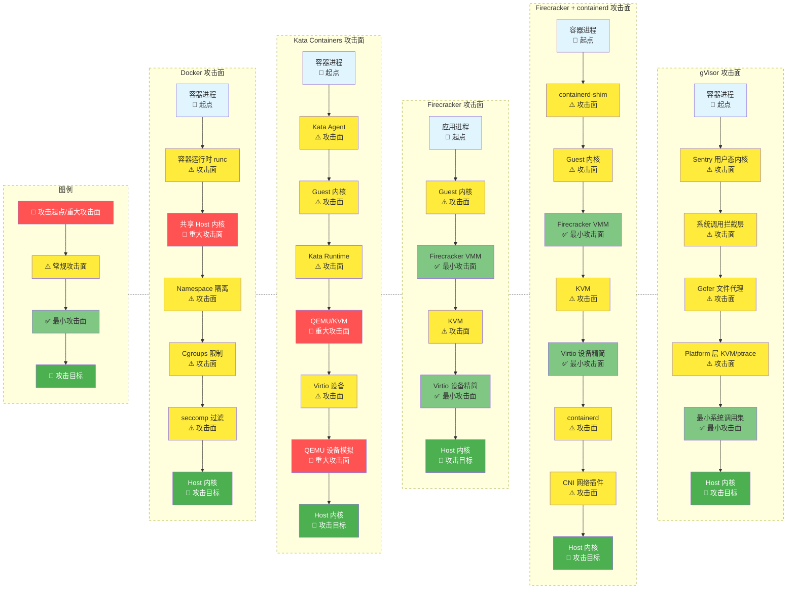

# sandbox_tech_overview.md

# AI Agent 基础设施平台沙箱技术方案调研 (v0.1)

> 本文档为《agentic-infra-solution.md》的核心子项目，专为高安全、可控、高性能的 AI Agent 基础设施平台提供沙箱技术选型终极依据。

## 1. 引言

### 1.1 调研范围与目标
系统性调研目前可用于生产级 AI Agent 的 Sandbox 技术路线，输出明确可落地的选型结论。

### 1.2 核心评估维度（按权重排序）
1. 安全性（逃逸难度）—— 一票否决项
2. 冷启动时间 —— 决定用户体验
3. 执行延迟 —— 决定 Agent 思考速度
4. 功能完整度（网络、文件系统、包管理）
5. 并发扩展性（>1000 并行 Agent）
6. 生态成熟度与可观测性
7. 成本与运维复杂度

## 2. AI Agent 对 Sandbox 的极端需求（需求侧刚需）

### 2.1 必须支持的 Top 5 能力
1. 任意代码执行（Python、Node.js、Bash、Go、Rust 等）
2. 出站网络访问（HTTP/HTTPS、WebSocket、RAW TCP/UDP）
3. 真实文件系统读写（项目文件、临时文件、上传下载）
4. 子进程与系统调用
5. 动态安装第三方依赖（pip、npm、go mod、cargo 等）

### 2.2 安全底线（红线）
- p0 容器逃逸难度（0day 极难利用）
- p0 防止 DoS 宿主机或自身
- p1 防止敏感数据泄露
- p1 防止恶意包供应链攻击


### 2.3 性能与体验硬指标 (待定)
- 冷启动时间 < 800ms（目标 < 300ms）
- 代码执行延迟 < 50ms（目标 < 20ms）
- 单机支持 > 1000 并行 Agent 实例

## 3. Sandbox 技术按隔离层次分类

> **分类说明**：按照隔离机制的实现层次从轻到重排序，每种方案都有其适用场景和权衡

### 3.1 语言运行时级隔离 - 最轻最快，但受限于语言支持

**核心特点**：在编程语言虚拟机/运行时层面提供隔离，无需操作系统级隔离机制

#### 3.1.1 WebAssembly (WASM)

**主流运行时：**
- **Wasmtime** (Bytecode Alliance) - 生产就绪，性能优秀
- **Wasmer** - 多语言绑定，插件系统友好
- **WasmEdge** - 边缘计算优化，支持 WASI-Socket
- **WAMR** (WebAssembly Micro Runtime) - 嵌入式/IoT

**性能指标：**
```yaml
启动速度: < 1ms (冷启动) ⚡⚡
内存开销: ~1-3MB (运行时) + 几百KB (每实例)
执行性能: 80-95% 原生性能
单机密度: 数万个实例
```

**隔离机制：**
- 线性内存模型（每个模块独立内存空间）
- 能力安全模型 (WASI Capability-based security)
- 默认无权限，显式授权文件/网络访问
- 内存安全（无缓冲区溢出）

**优势：**
- ✅ 启动速度最快（< 1ms）
- ✅ 资源开销最小
- ✅ 极高密度部署
- ✅ 跨平台（x86, ARM, RISC-V）
- ✅ 默认安全（能力系统）
- ✅ 无需特权（不需要 root/KVM）

**劣势：**
- ❌ 语言支持有限（需编译到 WASM）
  - 良好支持：Rust, C/C++, Go, AssemblyScript
  - 一般支持：Python, Ruby (解释器打包，体积大)
- ❌ 系统调用受限（仅 WASI）
- ❌ 生态不如容器成熟
- ❌ 无法运行现有二进制（需重新编译）
- ❌ 多线程支持刚起步

**AI Agent 适用场景：**
- ✅ 代码解释器（支持的语言）
- ✅ 轻量级函数执行
- ✅ 插件系统（安全执行第三方代码）
- ✅ Edge Computing
- ❌ 浏览器自动化（无法运行 Chromium）
- ❌ 需要完整 OS 的场景

**实际案例：**
- Cloudflare Workers (V8 + WASM)
- Fastly Compute@Edge
- Shopify Functions

#### 3.1.2 V8 Isolates

**技术特点：**
- Chrome V8 引擎的隔离机制
- 主要运行 JavaScript，支持 WASM
- Cloudflare Workers 的底层技术

**性能指标：**
```yaml
启动速度: < 1ms
内存开销: ~2MB (包含 JS 上下文)
```

**与 WASM 对比：**
- 相同：都是语言运行时级，极快启动
- 差异：V8 Isolates 绑定 JavaScript 生态，WASM 更通用

### 3.2 操作系统级隔离 - 最成熟，但安全性中等

**核心特点**：共享宿主机内核，通过 Linux Namespace 和 Cgroups 实现隔离

#### 3.2.1 Linux Containers

**主流技术：**
- **Docker** - ⚠️ 明令禁止用于 Agent（安全性不足）
- **Podman** (rootless) - 仍不安全，不推荐
- **LXC/LXD** - 系统容器，功能完整
- **systemd-nspawn** - 轻量级容器

**性能指标：**
```yaml
启动速度: 100-500ms (冷启动)
内存开销: 5-50MB
单机密度: 数百个容器
```

**隔离机制：**
```yaml
Namespaces:
  - PID: 进程树隔离
  - Network: 网络栈隔离
  - Mount: 文件系统隔离
  - UTS: 主机名隔离
  - IPC: 进程间通信隔离
  - User: UID/GID 映射
  - Cgroup: 资源控制隔离

Cgroups (资源限制):
  - CPU 配额
  - 内存限制
  - I/O 限制
  - 网络带宽限制
```

**优势：**
- ✅ 生态最成熟（Docker Hub）
- ✅ 工具链丰富
- ✅ OCI 标准
- ✅ 镜像管理完善
- ✅ 无需特殊硬件

**劣势：**
- ❌ 共享内核（安全风险高）
- ❌ 内核漏洞影响所有容器
- ❌ 容器逃逸风险
- ❌ **AI Agent 场景禁用**

**AI Agent 适用场景：**
- ❌ 不可信代码执行 - 禁用
- ⚠️ 开发/测试环境 - 可考虑
- ⚠️ Docker + gVisor 组合 - 过渡方案

#### 3.2.2 其他 OS 级方案

- **FreeBSD Jails** - FreeBSD 原生容器
- **Solaris Zones** - 企业级容器

### 3.3 系统调用级隔离 - 安全性好，但有性能损耗

**核心特点**：拦截/虚拟化系统调用，在用户态实现"内核"，不共享宿主机内核

#### 3.3.1 gVisor (runsc) 

**技术架构：**
```yaml
组件:
  Sentry: 用户态内核 (Go 实现，内存安全)
  Gofer: 文件系统代理 (9P 协议)
  Platform: ptrace (默认) / KVM (性能更好)

工作原理:
  应用 → syscall → Sentry 拦截 → 处理/转发 → Gofer → 宿主机
```

**性能指标：**
```yaml
启动速度: 50-150ms
内存开销: 30-60MB
性能损耗:
  - CPU 密集: 5-15%
  - I/O 密集: 15-30%
  - 网络: 10-20%
单机密度: 高
```

**隔离机制：**
- 用户态内核（即使被攻破也不影响宿主机内核）
- 实现约 70% Linux 系统调用， 最新宣称95%
- Go 实现（内存安全，无缓冲区溢出）
- 多层防御

**优势：**
- ✅ 无需 KVM（纯用户态）
- ✅ OCI 兼容（runsc runtime）
- ✅ 额外的安全层
- ✅ Google 生产验证（Cloud Run）

**劣势：**
- ❌ 性能损耗 15-30%
- ❌ 系统调用兼容性约 70%，95%
- ❌ 某些应用无法运行
- ❌ 调试较困难

**AI Agent 适用场景：**
- ✅ 不可信代码执行
- ✅ 无法使用 KVM 的环境
- ✅ 多租户平台

#### 3.3.2 Nabla Containers

**技术特点：**
- Unikernel + 容器接口
- 极小攻击面（仅 7 个系统调用）
- 基于 Solo5 unikernel

**局限性：**
- 应用需要特殊构建
- 生态不成熟

### 3.4 硬件虚拟化级隔离 - 最强隔离，但需要 KVM

**核心特点**：使用 CPU 虚拟化扩展（Intel VT-x / AMD-V），提供硬件级隔离

#### 3.4.1 Firecracker microVM

**技术架构：**
```yaml
定位: AWS 专为 Serverless 设计的轻量级 VMM
实现: Rust 实现，内存安全
核心技术:
  - 基于 KVM
  - 最小化设备模型（仅必需设备）
  - 无 BIOS（直接加载内核）
  - virtio 设备（网络、块设备）
```

**性能指标：**
```yaml
启动速度: 125-175ms (生产环境) | 目标 < 200ms
内存开销: ~5MB (VMM) + Guest 内存 (最小 128MB)
单机密度: 数千个 microVM
执行延迟: ~25ms
```

**隔离机制：**
```
架构层次:
  应用
    ↓
  Guest Linux 内核 (独立)
    ↓
  KVM (硬件虚拟化层) ← 第一道安全边界
    ↓
  Firecracker VMM (用户态，Rust) ← 第二道安全边界
    ↓
  宿主机 Linux 内核
    ↓
  硬件 (Intel VT-x / AMD-V)
```

**优势：**
- ✅ 硬件级隔离（最强）
- ✅ 极快启动（< 200ms）
- ✅ 轻量（~5MB VMM）
- ✅ AWS Lambda/Fargate 生产验证
- ✅ Rust 实现（内存安全）
- ✅ 最小化攻击面
- ✅ **至今 0 次成功逃逸**

**劣势：**
- ❌ 需要 KVM（裸金属或支持嵌套虚拟化）
- ❌ 仅 Linux x86_64/aarch64
- ❌ 网络配置复杂（TAP 设备）
- ❌ 非 OCI 标准
- ❌ 镜像管理复杂
- ❌ Kubernetes 集成困难

**硬件要求：**
```yaml
必须:
  - Linux 宿主机
  - KVM 支持 (/dev/kvm)
  - Intel VT-x 或 AMD-V

云平台兼容性:
  - AWS EC2 (i3.metal): ✅ 完美支持
  - Google cloud: ✅ 完美支持
  - 阿里云 (ECS 裸金属/g7): ✅ 支持
  - 腾讯云 (CVM C6): ⚠️ 部分支持
  - 普通虚拟机: ❌ 不支持（无嵌套虚拟化）
```

**AI Agent 适用场景：**
- ✅ 不可信代码执行（最高安全）
- ✅ Serverless 平台
- ✅ 浏览器自动化（完整 OS）
- ✅ 需要完整 Linux 环境


#### 3.4.2 Cloud Hypervisor

**技术特点：**
- Intel 开源，Rust 实现
- 类似 Firecracker，但设备支持更丰富
- 更好的 Kubernetes 集成

#### 3.4.3 Kata Containers (见 3.5 混合隔离)

#### 3.4.4 传统虚拟机

**技术：**
- KVM/QEMU
- VMware
- VirtualBox
- Hyper-V

**性能指标：**
```yaml
启动速度: 30s - 数分钟
内存开销: 512MB+
```

**适用场景：**
- 传统应用
- 长时间运行服务
- ❌ 不适合 AI Agent（启动太慢）

### 3.5 混合隔离

**核心特点**：结合多种技术，在性能、安全、易用性间平衡

#### 3.5.1 Kata Containers

**技术架构：**
```yaml
定位: OCI 兼容的轻量级 VM 运行时
实现:
  - 外层: OCI/CRI 接口（容器生态）
  - 内层: 轻量级 VM（硬件隔离）

支持的 Hypervisor:
  - QEMU (默认)
  - Cloud Hypervisor
  - Firecracker
  - Stratovirt
```

**性能指标：**
```yaml
启动速度: 1-2s (比 Firecracker 慢)
内存开销: 128MB+
执行延迟: ~60ms
单机密度: 中等（数十到上百）
```

**优势：**
- ✅ OCI/CRI 兼容（容器接口）
- ✅ Kubernetes 原生支持
- ✅ 硬件级隔离
- ✅ 多 Hypervisor 支持
- ✅ 企业级成熟度

**劣势：**
- ❌ 启动比 Firecracker 慢 5-10 倍
- ❌ 内存开销较大
- ❌ 配置复杂

**AI Agent 适用场景：**
- ✅ 企业级部署（合规要求）
- ✅ Kubernetes 环境
- ⚠️ 对启动速度要求不高的场景

#### 3.5.2 gVisor + Firecracker 组合

**架构：**
```yaml
双层防御:
  应用
    ↓
  gVisor Sentry (用户态内核)
    ↓
  Firecracker VM (硬件隔离)
    ↓
  宿主机
```

**性能指标：**
```yaml
启动速度: 150-350ms
执行延迟: ~20ms
安全等级: ★★★★★★ (最高)
```

**优势：**
- ✅ 纵深防御（多层隔离）
- ✅ 安全性最强
- ✅ 功能完整
- ✅ **当前生产环境最优解**

**劣势：**
- ❌ 复杂度高
- ❌ 性能损耗叠加

#### 3.5.3 Docker + gVisor

**架构：**
```bash
docker run --runtime=runsc myapp
```

**定位：**
- 过渡方案
- 开发/测试环境可用
- 生产环境不推荐（Docker 本身风险）


## 4. 深度对比评估矩阵

### 4.1 综合性能与安全对比

| 评估维度 | Docker | gVisor | Firecracker | firecracker-containerd | Kata Containers | WASM (Wasmtime) |
|---------|--------|--------|-------------|----------------------|-----------------|-----------------|
| **安全等级** | ⭐ 共享内核 | ⭐⭐⭐⭐ 用户态内核 | ⭐⭐⭐⭐⭐ 硬件隔离 | ⭐⭐⭐⭐⭐ 硬件隔离 | ⭐⭐⭐⭐⭐ 硬件隔离 | ⭐⭐⭐ 能力安全 |
| **冷启动速度** | 500-1000ms | 50-150ms ⚡⚡ | 125-175ms ⚡⚡ | 150-200ms ⚡⚡ | 1-2s ⚠️ | **< 1ms ⚡⚡⚡** |
| **内存占用** | 5-50MB | 30-60MB | 133MB (5+128) | 138MB (10+128) | 128MB+ | **1-3MB** ✅ |
| **CPU 性能** | 95-100% ✅ | 85-95% ⚠️ | 95-100% ✅ | 95-100% ✅ | 90-95% ✅ | 80-95% ⚠️ |
| **网络性能** | 95-100% ✅ | 80-90% ⚠️ | 95-100% ✅ | 95-100% ✅ | 90-95% ✅ | 85-95% ✅ |
| **系统调用兼容** | 100% | ~95% | 100% | 100% | 100% | WASI only ❌ |
| **部署密度** | 高 (数百) | 高 (数百) | 极高 (数千) ⚡⚡ | 极高 (数千) ⚡⚡ | 中 (数十-百) | **极高 (数万) ⚡⚡⚡** |
| **生态成熟度** | ⭐⭐⭐⭐⭐ 最成熟 | ⭐⭐⭐⭐ 成熟 | ⭐⭐⭐⭐ 生产级 | ⭐⭐⭐ 实验性 | ⭐⭐⭐⭐ 企业级 | ⭐⭐⭐ 快速发展 |
| **硬件要求** | 无特殊要求 | 无需 KVM ✅ | **需要 KVM** ❌ | **需要 KVM** ❌ | **需要 KVM** ❌ | 无特殊要求 ✅ |
| **AI Agent 推荐** | **禁用** ❌ | ⭐⭐⭐⭐ 推荐 | ⭐⭐⭐⭐⭐ 最佳 | ⭐⭐⭐⭐ 推荐 | ⭐⭐⭐ 可用 | ⭐⭐⭐⭐ 推荐 |

### 4.2 详细指标说明

#### 安全等级

**安全等级评分：**
- ⭐ (Docker): 共享内核，容器逃逸风险高
- ⭐⭐⭐⭐ (gVisor): 用户态内核，额外隔离层
- ⭐⭐⭐⭐⭐ (Firecracker/Kata): 硬件级虚拟化隔离
- ⭐⭐⭐ (WASM): 能力安全模型，但语言运行时级隔离

**攻击面对比可视化：**



**攻击面分析总结：**

| 技术 | 攻击路径长度 | 关键代码量 | 关键防御层 | 重大攻击面 | 安全评级 |
|------|-------------|-----------|-----------|-----------|---------|
| **Docker** | 7 层 | ~50K LoC (runc) + 内核 | Namespace + seccomp | 共享内核 (🔴) | ⭐ 最低 |
| **Kata Containers** | 8 层 | ~1.2M LoC (QEMU) | Guest 内核 + KVM | QEMU 设备模拟 (🔴) | ⭐⭐⭐⭐ 较高 |
| **Firecracker** | 6 层 | **~50K LoC** (Rust) | Guest 内核 + KVM | 无 (✅ 最小化) | ⭐⭐⭐⭐⭐ 最高 |
| **Firecracker + containerd** | 9 层 | ~50K + ~100K LoC | Guest 内核 + KVM | containerd 复杂度 (⚠️) | ⭐⭐⭐⭐ 高 |
| **gVisor** | 7 层 | ~200K LoC (Go) | Sentry 用户态内核 | 系统调用拦截层 (⚠️) | ⭐⭐⭐⭐ 高 |

**代码复杂度说明：**
- **Docker (runc)**: ~50,000 行 C/Go 代码，但共享宿主机内核（数百万行）
- **QEMU**: ~1,200,000 行 C 代码，设备模拟复杂度极高
- **Firecracker VMM**: ~50,000 行 Rust 代码（内存安全），最小化设备模型
- **gVisor Sentry**: ~200,000 行 Go 代码（内存安全），用户态内核实现
- **containerd**: ~100,000 行 Go 代码，容器编排复杂度

**关键洞察：**
1. **Firecracker 安全性最优**：攻击路径最短（6层）+ 代码量最小（~50K LoC Rust）+ 无重大攻击面 + 内存安全语言
2. **Kata (QEMU) 复杂度最高**：代码量最大（~1.2M LoC C）+ 攻击路径最长（8层）+ QEMU 设备模拟是重大攻击面
3. **Docker 致命缺陷**：虽然 runc 代码量小（~50K LoC），但共享宿主机内核是不可接受的安全风险，AI Agent 场景禁用
4. **gVisor 纵深防御**：用户态内核（~200K LoC Go）避免直接内核攻击 + 内存安全语言提供额外保护，但性能有一定损耗
5. **Firecracker + containerd 权衡**：增加了编排复杂度（+~100K LoC）和攻击路径（9层），但保持硬件隔离核心优势
6. **代码量与安全性排序**：Firecracker (50K Rust) < gVisor (200K Go) < Kata (1.2M C) — 更小的代码量配合内存安全语言是更优选择

#### 冷启动速度
```yaml
WASM:              < 1ms        ⚡⚡⚡ 最快
gVisor:            50-150ms     ⚡⚡
Firecracker:       125-175ms    ⚡⚡
firecracker-c*:    150-200ms    ⚡⚡
Docker:            500-1000ms   ⚡
Kata:              1-2s         ⚠️ 较慢
```

#### 内存占用 (最小配置)
```yaml
WASM:              1-3MB        ✅ 最小
Firecracker:       5MB (VMM) + 128MB (Guest) = 133MB
gVisor:            30-60MB
firecracker-c*:    10MB + 128MB (Guest) = 138MB
Kata:              128MB+
Docker:            5-50MB
```

#### CPU 性能 (相对原生)
```yaml
Docker:            95-100%   ✅ 接近原生
Firecracker:       95-100%   ✅ 接近原生
Kata:              90-95%    ✅ 良好
gVisor:            85-95%    ⚠️ 有损耗
WASM:              80-95%    ⚠️ 取决于编译优化
```

#### 网络性能 (相对原生)
```yaml
Docker:            95-100%   ✅ 最好
Firecracker:       95-100%   ✅ virtio 网络
Kata:              90-95%    ✅ 良好
WASM:              85-95%    ✅ WASI-Socket
gVisor:            80-90%    ⚠️ 用户态网络栈损耗
```

#### 系统调用兼容性
```yaml
Docker:            100%         ✅ 完全兼容
Firecracker:       100%         ✅ 完整 Linux
Kata:              100%         ✅ 完整 Linux
firecracker-c*:    100%         ✅ 完整 Linux
gVisor:            ~95%         ⚠️ 部分系统调用不支持
WASM:              WASI only    ❌ 仅支持 WASI 标准接口
```

#### 部署密度 (单机并发实例)
```yaml
WASM:              数万个       ⚡⚡⚡ 最高
Firecracker:       数千个       ⚡⚡
firecracker-c*:    数千个       ⚡⚡
gVisor:            数百个       ⚡
Docker:            数百个       ⚡
Kata:              数十-百      ⚠️ 较低
```

#### 生态成熟度
```yaml
Docker:            ⭐⭐⭐⭐⭐  最成熟
  - Docker Hub
  - Kubernetes 原生支持
  - 工具链完善

gVisor:            ⭐⭐⭐⭐    成熟
  - Google 生产验证
  - OCI 兼容
  - Cloud Run 使用

Firecracker:       ⭐⭐⭐⭐    生产级
  - AWS Lambda 使用
  - 社区活跃
  - 文档完善

Kata:              ⭐⭐⭐⭐    企业级
  - CNCF 项目
  - Kubernetes CRI 支持
  - 多云支持

firecracker-c*:    ⭐⭐⭐      实验性
  - AWS 官方项目
  - 维护不够活跃
  - 文档较少

WASM:              ⭐⭐⭐      快速发展
  - WASI 标准化中
  - 边缘计算热门
  - 工具链改进中
```

#### 硬件要求
```yaml
需要 KVM (必须):
  - Firecracker        ❌ 必须有 /dev/kvm
  - firecracker-c*     ❌ 必须有 /dev/kvm
  - Kata (KVM 模式)    ❌ 必须有 /dev/kvm

无需 KVM:
  - Docker             ✅ 无特殊要求
  - gVisor             ✅ 纯用户态
  - WASM               ✅ 无特殊要求
```

### 4.3 AI Agent 场景推荐度

| 方案 | 代码解释器 | 浏览器自动化 | 插件系统 | 长时运行 | Serverless | 边缘计算 | 综合推荐 |
|------|-----------|-------------|---------|---------|-----------|---------|---------|
| **Docker** | ❌ 禁用 | ❌ 禁用 | ❌ 禁用 | ❌ 禁用 | ❌ 禁用 | ❌ | **禁用** |
| **gVisor** | ✅ 推荐 | ⚠️ 可用 | ✅ 推荐 | ✅ 推荐 | ✅ 推荐 | ⚠️ 可用 | **⭐⭐⭐⭐** |
| **Firecracker** | ✅ 最佳 | ✅ 最佳 | ✅ 推荐 | ✅ 推荐 | ✅ 最佳 | ⚠️ 需KVM | **⭐⭐⭐⭐⭐** |
| **firecracker-c*** | ✅ 推荐 | ✅ 推荐 | ✅ 推荐 | ✅ 推荐 | ✅ 推荐 | ⚠️ 需KVM | **⭐⭐⭐⭐** |
| **Kata** | ✅ 可用 | ✅ 可用 | ⚠️ 慢 | ✅ 推荐 | ⚠️ 慢 | ❌ 需KVM | **⭐⭐⭐** |
| **WASM** | ⚠️ 受限 | ❌ 不支持 | ✅ 最佳 | ⚠️ 受限 | ✅ 最佳 | ✅ 最佳 | **⭐⭐⭐⭐** |
| **gVisor+FC** | ✅ 最佳 | ✅ 最佳 | ✅ 最佳 | ✅ 最佳 | ✅ 最佳 | ⚠️ 需KVM | **⭐⭐⭐⭐⭐⭐** |

**说明：**
- ✅ 最佳/推荐：完全适用，性能和安全俱佳
- ⚠️ 可用/受限：可以使用但有限制
- ❌ 禁用/不支持：不建议或无法使用
- **firecracker-c*** = firecracker-containerd

## 5. 头部团队 AI Agent / 代码执行平台真实选型

| 团队/产品 | 沙箱方案 | 技术栈 | 应用场景 | 备注 |
|----------|---------|-------|---------|------|
| **E2B** | Firecracker microVM | 开源 infra | AI Agent 代码执行 | 开源基础设施，商业托管 |
| **Modal** | gVisor | runsc + 容器 | AI/ML 工作负载 | Python 优先，GPU 支持 |
| **OpenAI Code Interpreter** | Firecracker (推测) | 定制化 | ChatGPT 代码执行 | 高安全隔离 |
| **Replit** | gVisor / NixOS 容器 | 多层隔离 | 在线 IDE | 实时协作编程 |
| **GitHub Codespaces** | Docker + 安全加固 | Dev Containers | 云开发环境 | 企业级权限控制 |
| **Jupyter Hub** | Docker / Kubernetes | 容器化 | 数据科学 Notebook | 多租户隔离 |

## 6. agentic-infra-solution Sandbox 选型建议
 首选 gVisor 和 firecracker + firecracker-containerd

### 6.1 场景化推荐

| 场景 | 推荐方案 | 理由 | 备选方案 |
|------|---------|------|---------|
| **MVP 快速验证** | gVisor | 无需 KVM，部署简单，快速上线 | Firecracker (如有 KVM) |
| **生产环境高性能** | Firecracker | 硬件级隔离，启动快 (< 200ms)，安全性最强 | gVisor + Firecracker 双层 |
| **无 KVM 环境** | gVisor | 纯用户态，无硬件依赖 | WASM (特定场景) |
| **企业级合规** | Kata Containers | OCI 兼容，Kubernetes 原生支持，企业级成熟度 | Firecracker |
| **边缘计算** | WASM | 极小内存占用，< 1ms 启动 | V8 Isolates |
| **GPU 工作负载** | Kata Containers | GPU 直通支持好 | Docker + 安全加固 |

### 6.2 混合运行时架构设计

**核心理念：** 通过运行时抽象层，支持多种 Sandbox 技术，根据环境和需求动态选择最优方案。

#### 6.2.1 多运行时支持架构Demo示意

```go
// Runtime 接口抽象 - 统一所有沙箱运行时
type Runtime interface {
    // 生命周期管理
    Create(config *SandboxConfig) (*Sandbox, error)
    Start(id string) error
    Stop(id string) error
    Delete(id string) error

    // 状态查询
    Status(id string) (*SandboxStatus, error)
    List() ([]*Sandbox, error)

    // 资源管理
    Exec(id string, cmd *Command) (*ExecResult, error)
    AttachConsole(id string) (io.ReadWriteCloser, error)

    // 元数据
    Name() string           // "firecracker", "gvisor", "kata"
    Capabilities() []string // 支持的功能列表
}

// 具体实现
type FirecrackerRuntime struct {
    vmPool      *VMPool
    snapshotter Snapshotter
    network     NetworkManager
}

type GVisorRuntime struct {
    runscPath string
    platform  string // "ptrace" or "kvm"
}

type KataRuntime struct {
    hypervisor string // "qemu", "cloud-hypervisor", "firecracker"
}

type WASMRuntime struct {
    engine string // "wasmtime", "wasmer", "wasmEdge"
}

// 运行时选择器
type RuntimeSelector struct {
    runtimes       map[string]Runtime
    defaultRuntime string
    capabilities   *CapabilityDetector
}

func NewRuntimeSelector() *RuntimeSelector {
    selector := &RuntimeSelector{
        runtimes:     make(map[string]Runtime),
        capabilities: NewCapabilityDetector(),
    }

    // 注册所有可用的运行时
    selector.Register("firecracker", NewFirecrackerRuntime())
    selector.Register("gvisor", NewGVisorRuntime())
    selector.Register("kata", NewKataRuntime())
    selector.Register("wasm", NewWASMRuntime())

    return selector
}

func (s *RuntimeSelector) Register(name string, runtime Runtime) {
    s.runtimes[name] = runtime
}

// 动态运行时选择
func (s *RuntimeSelector) SelectRuntime(config *SandboxConfig) (Runtime, error) {
    // 1. 用户显式指定
    if config.PreferredRuntime != "" {
        if rt, ok := s.runtimes[config.PreferredRuntime]; ok {
            return rt, nil
        }
    }

    // 2. 环境能力检测
    caps := s.capabilities.Detect()

    // 3. 安全等级要求优先
    if config.SecurityLevel == "high" {
        if caps.HasKVM {
            return s.runtimes["firecracker"], nil
        }
        return s.runtimes["gvisor"], nil
    }

    // 4. 性能优先
    if config.PerformancePriority {
        if caps.HasKVM {
            return s.runtimes["firecracker"], nil
        }
        // 降级到 gVisor
        return s.runtimes["gvisor"], nil
    }

    // 5. 特殊能力需求
    if config.RequireGPU {
        return s.runtimes["kata"], nil
    }

    if config.RequireWASM {
        return s.runtimes["wasm"], nil
    }

    // 6. 默认运行时
    return s.runtimes[s.defaultRuntime], nil
}
```

#### 6.2.2 环境能力检测

```go
// 能力检测器
type CapabilityDetector struct {
    cache *CapabilityCache
}

type Capabilities struct {
    HasKVM            bool
    KernelVersion     string
    SupportedRuntimes []string
    CPUVirtualization bool
    MemoryGB          int
    NestedVirt        bool
}

func (d *CapabilityDetector) Detect() *Capabilities {
    caps := &Capabilities{}

    // 检测 KVM
    caps.HasKVM = d.checkKVM()

    // 检测内核版本
    caps.KernelVersion = d.getKernelVersion()

    // 检测 CPU 虚拟化
    caps.CPUVirtualization = d.checkCPUVirt()

    // 检测嵌套虚拟化
    caps.NestedVirt = d.checkNestedVirt()

    // 根据能力确定支持的运行时
    caps.SupportedRuntimes = d.determineSupportedRuntimes(caps)

    return caps
}

func (d *CapabilityDetector) checkKVM() bool {
    // 检查 /dev/kvm 是否存在且可访问
    _, err := os.Stat("/dev/kvm")
    if err != nil {
        return false
    }

    // 尝试打开设备
    f, err := os.OpenFile("/dev/kvm", os.O_RDWR, 0)
    if err != nil {
        return false
    }
    defer f.Close()

    return true
}

func (d *CapabilityDetector) checkCPUVirt() bool {
    // 读取 /proc/cpuinfo
    data, _ := os.ReadFile("/proc/cpuinfo")
    content := string(data)

    // 检测 Intel VT-x 或 AMD-V
    return strings.Contains(content, "vmx") || strings.Contains(content, "svm")
}

func (d *CapabilityDetector) determineSupportedRuntimes(caps *Capabilities) []string {
    runtimes := []string{}

    // gVisor 和 WASM 总是支持
    runtimes = append(runtimes, "gvisor", "wasm")

    // KVM 相关运行时
    if caps.HasKVM {
        runtimes = append(runtimes, "firecracker", "kata")
    }

    return runtimes
}
```

#### 6.2.3 降级策略

```go
// 降级策略配置
type FallbackPolicy struct {
    Strategy string // "strict", "best-effort", "fail"
    Chain    []string
}

// 运行时降级管理器
type FallbackManager struct {
    selector *RuntimeSelector
    policy   *FallbackPolicy
}

func (m *FallbackManager) CreateSandboxWithFallback(config *SandboxConfig) (*Sandbox, error) {
    // 尝试优先运行时
    runtime, err := m.selector.SelectRuntime(config)
    if err != nil {
        return nil, err
    }

    sandbox, err := runtime.Create(config)
    if err == nil {
        return sandbox, nil
    }

    // 降级策略
    switch m.policy.Strategy {
    case "strict":
        // 严格模式：失败即返回
        return nil, err

    case "best-effort":
        // 尽力而为：尝试降级链
        return m.tryFallbackChain(config, err)

    case "fail":
        // 快速失败
        return nil, err

    default:
        return nil, err
    }
}

func (m *FallbackManager) tryFallbackChain(config *SandboxConfig, lastErr error) (*Sandbox, error) {
    for _, runtimeName := range m.policy.Chain {
        runtime, ok := m.selector.runtimes[runtimeName]
        if !ok {
            continue
        }

        sandbox, err := runtime.Create(config)
        if err == nil {
            // 记录降级事件
            log.Warnf("Fallback to %s due to: %v", runtimeName, lastErr)
            return sandbox, nil
        }

        lastErr = err
    }

    return nil, fmt.Errorf("all fallback runtimes failed: %v", lastErr)
}

// 预设降级链
var DefaultFallbackPolicies = map[string]*FallbackPolicy{
    "high-security": {
        Strategy: "best-effort",
        Chain:    []string{"firecracker", "gvisor", "kata"},
    },
    "high-performance": {
        Strategy: "best-effort",
        Chain:    []string{"firecracker", "kata", "gvisor"},
    },
    "maximum-compatibility": {
        Strategy: "best-effort",
        Chain:    []string{"gvisor", "kata", "firecracker"},
    },
}
```


### 6.3 实施建议
 分阶段实施，快速上线验证，先跑通整体流程
#### 阶段 1：MVP 
- ✅ 实现 Runtime 接口抽象
- ✅ 集成 gVisor 运行时（优先）
- ✅ 简单的能力检测
- ✅ 基础 API 和 SDK

#### 阶段 2：生产就绪
- ✅ 集成 Firecracker 运行时
- ✅ 完整的降级策略
- ✅ 监控和告警
- ✅ 性能优化

#### 阶段 3：企业级 
- ✅ 高级调度策略（超卖，极致成本与体验平衡）
